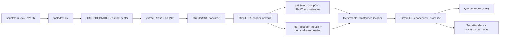

# OmniTrack Figure 2 / Algorithm 1 代码对照

基于当前分支 `370456c` 的静态梳理，目标是把论文中的 Figure 2 和 Algorithm 1 映射到当前仓库里的实际代码位置，方便后续继续读代码和准备 TBD 复现。

这份文档默认以 `projects/configs/JRDB_OmniTrack.py` 这条 JRDB 2019 E2E baseline 路径为主。README 里的 pipeline 图语义上和论文 PDF 里的总览图是同一套 OmniTrack 推理框架。

## 1. 结论

- 当前 `JRDB_OmniTrack.py` 默认跑的是 E2E，不是 TBD。
- E2E / TBD 的真正开关不在 config，而在 `projects/mmdet3d_plugin/models/omnidetr/instance_back_omnidetr.py:95-109`。
- 当前代码里最实际接通的 TBD 路径是 `Hybrid_Sort`。`OCsort` / `ByteTrack` 虽然有分支和导入，但 `TrackHandler` 目前仍然硬编码实例化 `Hybrid_Sort`。
- `temp_query=True` 和 `is_track=True` 很重要，但它们不是 E2E / TBD 模式开关：
  - `temp_query=True` 控制“上一帧轨迹是否回灌成 FlexiTrack Instances”
  - `is_track=True` 控制 `post_process()` 是否走 tracking 输出

## 2. 推理主调用链

按代码调用顺序，主链如下：

1. `scripts/run_eval_e2e.sh:37-40` 调 `tools/test.py`，默认配置是 `projects/configs/JRDB_OmniTrack.py`。
2. `tools/test.py:142-235` 读 config、build detector。
3. `projects/mmdet3d_plugin/models/jrdb2d_Omnidetr.py:150-154` 在 `simple_test()` 中先 `extract_feat()`，再调用 `head()` 和 `head.post_process()`。
4. `projects/mmdet3d_plugin/models/jrdb2d_Omnidetr.py:64-91` 的 `extract_feat()` 先过 backbone，再过 `CircularStatE`。
5. `projects/mmdet3d_plugin/models/omnidetr/omnidetr_head.py:156-221` 的 `forward()` 负责：
   - 当前帧 query 构造
   - 轨迹 query 回灌
   - decoder 解码
6. `projects/mmdet3d_plugin/models/omnidetr/omnidetr_head.py:324-450` 的 `post_process()` 负责：
   - 将 decoder 输出解释成 tracking 结果
   - 调 `instance_bank.query_handler(...)`
7. `projects/mmdet3d_plugin/models/omnidetr/instance_back_omnidetr.py:669-670` 再把请求分发给：
   - `QueryHandler`，即 E2E tracklet management
   - `TrackHandler`，即 TBD + 外部 data association

## 3. Figure 2 与代码组件对照

| 论文模块 | 代码位置 | 现在在代码里的具体含义 |
| --- | --- | --- |
| Backbone | `projects/configs/JRDB_OmniTrack.py:61-77`、`projects/mmdet3d_plugin/models/jrdb2d_Omnidetr.py:64-91` | `JRDB2DOMNIDETR.extract_feat()` 里用 ResNet 提取当前帧特征。 |
| CSEM / CircularStatE Module | `projects/configs/JRDB_OmniTrack.py:77-80`、`projects/mmdet3d_plugin/models/omnidetr/CircularStatE.py:15-87` | 论文里的畸变/环形上下文建模模块，对 backbone 多尺度特征做进一步编码。 |
| Learnable Instances | `projects/mmdet3d_plugin/models/omnidetr/omnidetr_head.py:238-294` | 代码里没有一个同名类；它落在 `_get_decoder_input()` 里，用 encoder top-k feature + anchor 生成当前帧 query。 |
| FlexiTrack Instances | `projects/mmdet3d_plugin/models/omnidetr/instance_back_omnidetr.py:379-626` | 论文里的上一帧轨迹实例。在推理时由 `get_temp_group()` 从已有 tracks 生成 temp queries。 |
| Decoder | `projects/mmdet3d_plugin/models/omnidetr/omnidetr_head.py:156-221`、`projects/mmdet3d_plugin/models/omnidetr/transformer.py:287-351` | 将 current-frame queries 和 temp queries 一起送进 deformable transformer decoder。 |
| Tracklet Management | `projects/mmdet3d_plugin/models/omnidetr/query_handler_module.py:17-199`、`projects/mmdet3d_plugin/models/track/strack.py:6-165` | E2E 模式下的轨迹初始化、更新、丢失与保留。 |
| DA / Track-by-Detection | `projects/mmdet3d_plugin/models/omnidetr/track_handler_module.py:27-115`、`projects/mmdet3d_plugin/models/trackers/hybrid_sort_tracker/hybrid_sort.py:284-452` | TBD 模式下，decoder 输出先变成 detections，再交给外部 tracker 做关联。 |
| Hungarian / Distance Calculation | `projects/mmdet3d_plugin/models/trackers/hybrid_sort_tracker/association.py:290-300,524-575` | 论文 Algorithm 1 里 DA 分支的距离矩阵与匈牙利匹配。 |

这里最值得单独记住的一点是：

- 论文里的 `I_F` 和 `I_L` 在代码里不是两个独立模块，而是两类 query。
- `I_F` 由 `get_temp_group()` 生成，`I_L` 由 `_get_decoder_input()` 生成。
- 二者最终在 `projects/mmdet3d_plugin/models/omnidetr/omnidetr_head.py:292-294` 被拼接到同一个 decoder 输入里。

## 4. Algorithm 1 逐步对照

### Step 0: 初始化轨迹集合和阈值

论文里算法开头会维护一个轨迹集合 `T`，并设置初始化/更新阈值。

代码对应：

- `projects/mmdet3d_plugin/models/omnidetr/instance_back_omnidetr.py:72-93`
  - 初始化 `self.starcks = []`
  - 初始化 `frame_id / timestamp / max_time_lost`
- E2E 阈值在 `projects/mmdet3d_plugin/models/omnidetr/query_handler_module.py:25-28`
  - `init_thresh = 0.315`
  - `det_thresh = 0.10`
  - `track_thresh = 0.39`
- TBD 阈值在 `projects/mmdet3d_plugin/models/omnidetr/track_handler_module.py:30-33`
  - `track_thresh = 0.45`
  - `det_thresh = 0.10`
  - `init_thresh = 0.55`
- 外部 HybridSORT 的默认关联参数来自 `projects/mmdet3d_plugin/models/trackers/args.py:45-57`

### Step 1: 当前帧特征提取

算法里的“当前帧输入 -> Backbone/CSEM”对应：

- `projects/mmdet3d_plugin/models/jrdb2d_Omnidetr.py:64-91`
- `projects/mmdet3d_plugin/models/omnidetr/CircularStatE.py:87-101`

也就是：

1. 当前 stitched image 进入 ResNet backbone。
2. backbone 输出多尺度特征。
3. `CircularStatE.forward()` 对这些特征做环形场景建模。

### Step 2: 从上一帧轨迹构造 FlexiTrack Instances

Algorithm 1 里的 `I_F <- T_{f_{k-1}}` 对应：

- `projects/mmdet3d_plugin/models/omnidetr/omnidetr_head.py:175-176`
- `projects/mmdet3d_plugin/models/omnidetr/instance_back_omnidetr.py:379-626`

推理时真正起作用的是 `get_temp_group()` 的 inference 分支：

- E2E: `projects/mmdet3d_plugin/models/omnidetr/instance_back_omnidetr.py:555-563`
  - 从 `self.starcks` 读出已有 `STrack`
  - 转成 `cxcywh`
  - 作为 temp queries 回灌 decoder
- TBD:
  - `:564-575` 为 OCSort 分支
  - `:576-587` 为 HybridSORT 分支
  - `:588-599` 为 ByteTrack 分支

这些 query 最后会变成 `padding_cls / padding_bbox / attn_mask`，并在 decoder 里作为前缀 query 使用。

### Step 3: 构造当前帧 Learnable Instances

Algorithm 1 里的当前帧实例 `I_L` 对应：

- `projects/mmdet3d_plugin/models/omnidetr/omnidetr_head.py:238-294`

关键点：

- `_get_encoder_input()` 把 neck 输出 flatten 成 encoder token。
- `_get_decoder_input()` 生成 anchor、做 encoder top-k 选择。
- `top_k_features` 和 `refer_bbox` 就是当前帧 query 的主要来源。

实现上，论文里的 Learnable Instances 并没有落成一个独立类，而是“当前帧 query 生成过程”。

### Step 4: Decoder 同时处理 `I_F` 和 `I_L`

Algorithm 1 里的 `D_F^k, D_L^k <- Decoder(I_F, I_L)` 对应：

- `projects/mmdet3d_plugin/models/omnidetr/omnidetr_head.py:292-294`
- `projects/mmdet3d_plugin/models/omnidetr/transformer.py:287-351`

代码里的关键动作是：

1. 如果 `temp_embed` 存在，先把 temp queries 拼到 decoder 输入最前面。
2. 再把当前帧 queries 接到后面。
3. decoder 一次性输出所有 query 的 bbox / cls / quality。

这意味着：

- 输出张量前部是 `D_F^k`
- 输出张量后部是 `D_L^k`

这个“前半段是 track queries，后半段是 learnable queries”的约定，在后面的 E2E 分支里会被显式拆开。

### Step 5A: E2E 分支

Algorithm 1 在非 DA 分支里会：

- 用已有轨迹更新 `T`
- 用新 detections 初始化新轨迹
- 删除长期丢失轨迹

代码对应：

- `projects/mmdet3d_plugin/models/omnidetr/omnidetr_head.py:389`
- `projects/mmdet3d_plugin/models/omnidetr/query_handler_module.py:41-199`

最关键的对照关系在 `QueryHandler.query_handler()`：

- `projects/mmdet3d_plugin/models/omnidetr/query_handler_module.py:108-111`
  - `num_track = len(strack_pool)`
  - `torch.split(...)` 把 decoder 输出拆成：
    - `track_bboxes / track_scores`
    - `query_bboxes / query_scores`
- 这正对应论文里的 `D_F^k` 与 `D_L^k`

后续逻辑：

- `:124-140` 对 track queries 做重评分和 NMS
- `:153-160` 用 `track_thresh` 更新旧轨迹
- `:142-149, 164-187` 用 `det_thresh` 过滤 learnable queries，并用 `init_thresh` 初始化新轨迹
- `:191-195` 对 lost tracks 做保留/丢弃

底层 tracklet 数据结构由 `projects/mmdet3d_plugin/models/track/strack.py:6-165` 维护：

- `multi_predict()` 对应论文中的轨迹状态外推
- `activate()` 对应 Init
- `update()` 对应 Upd

### Step 5B: TBD / DA 分支

Algorithm 1 的 DA 分支对应：

- `projects/mmdet3d_plugin/models/omnidetr/track_handler_module.py:61-115`
- `projects/mmdet3d_plugin/models/trackers/hybrid_sort_tracker/hybrid_sort.py:303-452`
- `projects/mmdet3d_plugin/models/trackers/hybrid_sort_tracker/association.py:290-300,524-575`

这里的运行方式是：

1. `TrackHandler.query_handler()` 先把 decoder bbox/scores 转成 pixel-space detections。
2. 做一次阈值过滤和 NMS。
3. 把 detections 交给 `self.tracker.update(...)`。
4. `Hybrid_Sort.update()` 里完成：
   - 第一轮关联
   - BYTE 风格第二轮关联
   - 新轨迹初始化
   - dead tracklet 删除

和论文 Algorithm 1 的对应关系可以粗略看成：

- Distance Calculation -> `association.py`
- Hungarian Matching -> `linear_assignment()` / `linear_sum_assignment()`
- Upd / Init / Del -> `Hybrid_Sort.update()`

## 5. 训练侧的补充：为什么 Figure 2 里的 FlexiTrack 分支在代码里不是一眼能看出来

只看推理很容易迷惑：`FlexiTrack Instances` 到底是怎么“学”出来的？

代码里这部分是拆开的：

- `projects/mmdet3d_plugin/models/omnidetr/instance_back_omnidetr.py:261-339`
  - `cache()` 把上一帧 matched prediction 缓存下来，供下一帧 temp query 使用
- `projects/mmdet3d_plugin/models/omnidetr/traget_Omnidetr.py:16-417`
  - `OmniDETRBox2DTarget` 负责 temp denoising target
- `projects/mmdet3d_plugin/models/omnidetr/Omnidetr_loss.py:381-468`
  - `OmniDETRDetectionLoss.forward()` 会额外计算 `_dn` 和 `_temp` loss

所以：

- Figure 2 的 FlexiTrack 分支，在推理里主要看 `get_temp_group()`
- 但要理解它为什么能工作，训练侧还要看 `cache()` 和 `_temp loss`

## 6. E2E / TBD 开关到底在哪里

### 6.1 真正的模式开关

真正的分流点在：

- `projects/mmdet3d_plugin/models/omnidetr/instance_back_omnidetr.py:95-109`

当前代码是：

- `self.OCsort = False`
- `self.Hybridsort = False`
- `self.ByteTrack = False`
- 只要三者有一个为 `True`，就会令 `self.TBD = True`
- 否则 `self.TBD = False`

随后：

- `TBD=False` -> `self.instance_handler = QueryHandler(self)` -> E2E
- `TBD=True` -> `self.instance_handler = TrackHandler(self)` -> TBD

这套开关在作者官方提交 `c0f26d32e48e9e54a7867dd9fabe31f7afe2fe7e` 中就已经存在，不是当前分支后来才引入的。

### 6.2 为什么当前默认一定是 E2E

因为三个 backend flag 在 `__init__()` 里全是 `False`，所以：

- `self.TBD = False`
- 推理时一定走 `QueryHandler`
- 这就是你当前固定住的 JRDB E2E baseline

### 6.3 当前代码里哪个 TBD backend 真正可用

从“代码接线是否闭合”看，当前最实际的是 `Hybridsort`：

- `projects/mmdet3d_plugin/models/omnidetr/track_handler_module.py:37-42`
- `projects/mmdet3d_plugin/models/omnidetr/track_handler_module.py:88-93`

这两个位置都直接实例化了 `Hybrid_Sort(...)`。

反过来说：

- `OCSort` 虽然被 import 了，但只在注释里保留了实例化示例
- `BYTETracker` 也被 import 了，但 `TrackHandler` 并没有根据 `self.ByteTrack` 去实例化它

因此当前代码状态更准确的说法是：

- “存在 TBD 总开关”
- “存在 OCSort / HybridSORT / ByteTrack 的骨架分支”
- “真正接通并可继续复现的，是 HybridSORT 这条 TBD 路径”

### 6.4 哪些相关配置不是模式开关

下面这些量容易和 E2E / TBD 搞混，但它们不是同一个层面：

- `projects/configs/JRDB_OmniTrack.py:130`
  - `temp_query = True`
  - 控制是否把上一帧 tracks 回灌成 temp queries
- `projects/configs/JRDB_OmniTrack.py:131`
  - `is_track = True`
  - 控制 `post_process()` 是否输出 tracking 结果
- `projects/configs/JRDB_OmniTrack.py:38-39,238-248`
  - `tracking_test` / `tracking_threshold`
  - 主要影响 dataset/eval 侧行为，不是实例管理逻辑里的 E2E/TBD 分流

## 7. 为后续复现 TBD，最小需要盯住的文件

如果下一步要正式把 TBD 做成可切换、可实验的路径，最需要改的不是算法主体，而是“模式显式化”。

建议优先盯住这 4 个点：

1. `projects/mmdet3d_plugin/models/omnidetr/instance_back_omnidetr.py:95-109`
   - 把隐藏布尔值改成 config 可传入的 `tracking_mode` / `tracker_backend`
2. `projects/mmdet3d_plugin/models/omnidetr/track_handler_module.py:35-44,88-95`
   - 不再硬编码 `Hybrid_Sort`
   - 按 backend 选择 `OCSort / Hybrid_Sort / BYTETracker`
3. `projects/mmdet3d_plugin/models/omnidetr/instance_back_omnidetr.py:564-599`
   - 保证 `get_temp_group()` 的推理分支和实际 tracker backend 一致
4. `projects/configs/JRDB_OmniTrack.py:118-131`
   - 把模式参数显式写进 config，避免以后继续靠改源码开关

## 8. 推荐阅读顺序

如果后面继续沿论文顺着读代码，推荐顺序是：

1. `projects/configs/JRDB_OmniTrack.py`
2. `projects/mmdet3d_plugin/models/jrdb2d_Omnidetr.py`
3. `projects/mmdet3d_plugin/models/omnidetr/CircularStatE.py`
4. `projects/mmdet3d_plugin/models/omnidetr/omnidetr_head.py`
5. `projects/mmdet3d_plugin/models/omnidetr/instance_back_omnidetr.py`
6. `projects/mmdet3d_plugin/models/omnidetr/query_handler_module.py`
7. `projects/mmdet3d_plugin/models/omnidetr/track_handler_module.py`
8. `projects/mmdet3d_plugin/models/trackers/hybrid_sort_tracker/hybrid_sort.py`
9. `projects/mmdet3d_plugin/models/trackers/hybrid_sort_tracker/association.py`

## 9. 当前可直接复用的判断

为了后续讨论方便，可以先固定这几个判断：

- 当前 JRDB baseline 配置默认是 E2E。
- E2E 和 TBD 的分流点在 `InstanceBackOMNIDETR`，不是在 config。
- `QueryHandler` 是 E2E 的 tracklet management 实现。
- `TrackHandler + Hybrid_Sort` 是当前仓库里最实际的 TBD 实现入口。
- `get_temp_group()` 是 Figure 2 / Algorithm 1 里 FlexiTrack Instances 最关键的代码落点。
